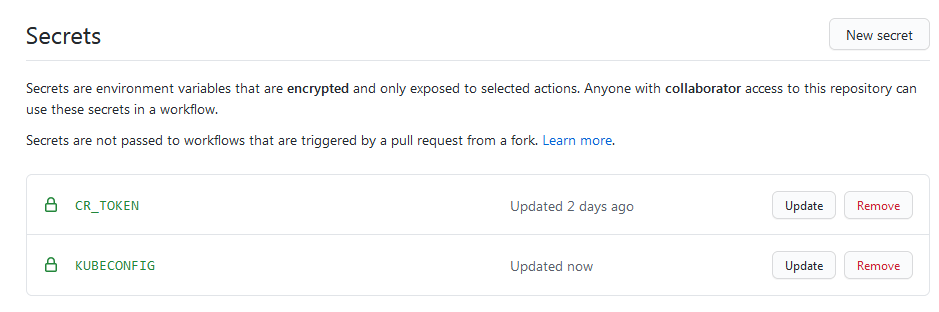

# Kubernetes infrastructure
This repository uses infrastructure as code to provision
a Kubernetes cluster.

## Options for running Kubernetes
Some options for provisioning a Kubernetes cluster:
1. Set up everything manually
[the hard way](https://napo.io/posts/kubernetes-the-real-hard-way-on-aws/) - 
a good but not very fast learning experience
2. Use a managed solution such as Amazon Elastic Kubernetes Service (Amazon EKS),
a fully managed Kubernetes control plane
3. Use [Kops](https://kops.sigs.k8s.io/)
4. Use [Terraform](https://www.terraform.io/)

Comparing Kops with EKS:
* Kops has a lower cost of entry - compared with EKS, it is easier and quicker to
create the cluster
* EKS has a lower maintenance cost - compared with Kops, it requires less work
to keep master nodes up to date

This repository will use Terraform and Kops to
provision a Kubernetes cluster in AWS.

## Prerequisites
Before being able to provision, these are the prerequisites:
* [Sign up](https://aws.amazon.com/free) for a free tier AWS account
* Install [terraform](https://learn.hashicorp.com/tutorials/terraform/install-cli)
* Install [kops](https://github.com/kubernetes/kops#installing)
* Install [kubectl](https://kubernetes.io/docs/tasks/tools/install-kubectl/)
* Install [AWS CLI](https://aws.amazon.com/cli/)
* Use an existing domain or register a free domain from for example freenom.com
* Create a hosted zone in Route 53 in AWS
  * Update NameServer values on the domain service provider
  * Validate NameServer records:
    ```
    (Windows) nslookup -type=soa <domain name>
  
    (Unix) dig ns <domain name>
    ```
    This should return one or more name server records that R53
    assigned to the hosted zone.
* Create an [IAM user for kops](https://github.com/kubernetes/kops/blob/master/docs/getting_started/aws.md#setup-iam-user)
* Decide which region to deploy in: `eu-west-1`
* Confirm which availability zones are available:
  ```
  aws ec2 describe-availability-zones --region eu-west-1
  ```
* Create an ssh key for logging into cluster:
  ```
  ssh-keygen
  ```
* Run `aws configure` and then export the keys:
  ```
  export AWS_ACCESS_KEY_ID=$(aws configure get aws_access_key_id)
  export AWS_SECRET_ACCESS_KEY=$(aws configure get aws_secret_access_key)
  ```

The rest of the infrastructure will be provisioned and
managed with Terraform and Kops.

## Terraform backend
To manage shared storage for state files, use Terraform’s built-in support for remote backends.
Setup a remote backend instead of local to store the state file.

A separate Terraform script will be used to create the needed S3 bucket.

It only needs to be run once to create the infrastructure
needed to enable remote backend storage:
```
cd remote_state
terraform init
terraform apply
```

Kops can now be used to create the Kubernetes resources.

## Cluster
First run Terraform from the `cluster` folder to
define Terraform backend and create Kops state S3 bucket:
```
cd cluster
terraform init
terraform apply
```

Choose as small node sizes as possible to avoid costs for the AWS free tier.
Create the cluster Terraform files with Kops:
```
kops create cluster \
    --cloud=aws \
    --name="mytempsite.tk" \
    --dns-zone="mytempsite.tk" \
    --state=s3://kops-state-kjg \
    --kubernetes-version="1.18.0" \
    --master-zones="eu-west-1a" \
    --zones="eu-west-1a" \
    --master-size="t2.medium" \
    --node-size="t2.micro" \
    --master-volume-size="8" \
    --node-volume-size="8" \
    --master-count="1" \
    --node-count="2" \
    --ssh-public-key="~/.ssh/kube.pub" \
    --out=./terraform-out \
    --target=terraform
```

If cluster creation runs successfully, the output will end with:
```
...

kops has set your kubectl context to mytempsite.tk

Terraform output has been placed into ./terraform-out
Run these commands to apply the configuration:
   cd ./terraform-out
   terraform plan
   terraform apply

Suggestions:
 * validate cluster: kops validate cluster --wait 10m
 * list nodes: kubectl get nodes --show-labels
 * ssh to the master: ssh -i ~/.ssh/id_rsa ubuntu@api.mytempsite.tk
 * the ubuntu user is specific to Ubuntu. If not using Ubuntu please use the appropriate user based on your OS.
 * read about installing addons at: https://kops.sigs.k8s.io/operations/addons.
```

Run Terraform and wait until the nodes have started and DNS changes
have propagated, this can take everything from a few minutes to hours. Then validate cluster as described.

Create `Tiller` service account and cluster role binding:
```
$ kubectl create -f tiller-rbac-config.yaml
```

Verify `Tiller` account, role, and binding:
```
kubectl --namespace kube-system get deploy tiller-deploy -o yaml
```

Install `Tiller` into the cluster:
```
$ helm init --service-account tiller
$ kubectl get pod -n kube-system | grep tiller
tiller-deploy-55f5dfddc9-zqx88                                        1/1     Running   0          13s
```

Store the generated Terraform files `terraform-out` in Git.

Store the Kube config as a `KUBECONFIG` secret in the [Helm registry repository](https://github.com/karl-johan-grahn/helm-registry):


The cluster is now ready for deploying Helm charts via the [Helm registry repository](https://github.com/karl-johan-grahn/helm-registry).

## Future work
For production purposes, evaluate these options:
* Consider using [Pulumi](https://www.pulumi.com/) instead of Terraform
* Consider doing provisioning entirely via GitHub workflow,
the official [setup-terraform](https://github.com/marketplace/actions/hashicorp-setup-terraform)
action relies on `Terraform Cloud`
* Consider switching to [Terraform Cloud](https://app.terraform.io/)
* Consider extending the remote state Terraform script to also include creating Kops IAM user and R53 Hosted Zone